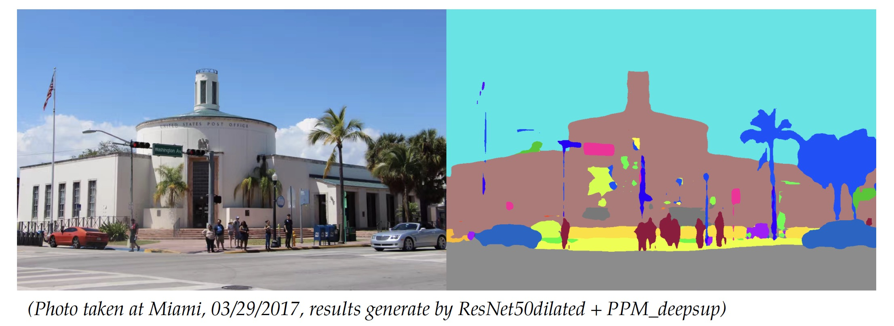

# scene-segmentation

<div id="top"></div>

<!-- PROJECT LOGO -->
<br />
<div align="center">
 <a href="https://github.com/zijzhao1996">
    
  </a>

<h3 align="center">Scene Segmentation (S2)</h3>

  <p align="center">
    Transfer Learning for Scene Segmentation using PyTorch DeepLab v3
    <br />
    <a href="https://github.com/zijzhao1996/README.md"><strong>Explore the docs »</strong></a>
    <br />
    <br />
    <a href="https://github.com/zijzhao1996/">View Demo</a>
    ·
    <a href="https://github.com/zijzhao1996/issues">Report Bug</a>
    ·
    <a href="https://github.com/zijzhao1996/issues">Request Feature</a>
  </p>
</div>


<!-- TABLE OF CONTENTS -->
<details>
  <summary>Table of Contents</summary>
  <ol>
    <li>
      <a href="#about-the-project">About The Project</a>
    </li>
    <li>
      <a href="#getting-started">Getting Started</a>
    </li>
    <li><a href="#usage">Usage</a></li>
    <li><a href="#outputs">Output demo</a></li>
    <li><a href="#license">License</a></li>
    <li><a href="#contact">Contact</a></li>
  </ol>
</details>


<!-- ABOUT THE PROJECT -->
## About The Project

Welcome to use Scene-Seg (S2)! This is a PyTorch implementation of semantic segmentation models on MIT ADE20K scene parsing dataset (http://sceneparsing.csail.mit.edu/). Developing this tool is also the main part of MIT 6.869 project, this tool is under active development.

The current model we offer is DeepLabV3 model with a ResNet-101 backbone. We use the pretrained the model from the torchvision module, and finetune on ADE20K. In the future, we plan to include more efficient models. 

<p align="right">(<a href="#top">back to top</a>)</p>


<!-- GETTING STARTED -->
## Getting Started

The code is developed under the following configurations.

Hardware: >=4 GPUs for training, >=1 GPU for testing
Software: Ubuntu 16.04.3 LTS, CUDA>=8.0, Python>=3.5, PyTorch>=0.4.0
Dependencies: numpy, scipy, opencv

Please make sure you computing environment has at least one available GPU.


<!-- USAGE EXAMPLES -->
## Usage

First, download the ADE20K dataset, which will download in your `./data ` folder.

```sh
chmod +x download_dataset.sh
./download_dataset.sh

```
For training, please excute following commands:

```python
python main.py --gpus 0,1,2,3
```

For inference, please check the inference demo noteook.


<p align="right">(<a href="#top">back to top</a>)</p>


<!-- OUTPUTS DeMO -->
## Outputs

You can check the time, pixel-wise accuracy, and training loss for each 20 iterations during each epoch.

```
###############################################################

       _____                            _____            
      / ____|                          / ____|           
     | (___   ___ ___ _ __   ___ _____| (___   ___  __ _ 
      \___ \ / __/ _ \ '_ \ / _ \______\___ \ / _ \/ _` |
      ____) | (_|  __/ | | |  __/      ____) |  __/ (_| |
     |_____/ \___\___|_| |_|\___|     |_____/ \___|\__, |
                                                    __/ |
                                                   |___/                                                                    

###############################################################
Welcome to use Scene-Seg (S2)! This is a PyTorch implementation 
of semantic segmentation models on MIT ADE20K scene parsing 
dataset (http://sceneparsing.csail.mit.edu/). 

Developing this tool is also the main part of MIT 6.869 project, 
which is under active development.

-- Author: Zijie Zhao
-- Date: Apr 26 2022

            
Current use model: DeepLabV3 model with a ResNet-101 backbone.
2022-04-26 18:05:02.704803: I tensorflow/stream_executor/platform/default/dso_loader.cc:44] Successfully opened dynamic library libcudart.so.10.1
# samples: 20210
1 Epoch = 5000 iters
Epoch: [1][0/5000], Avg Train Time: 1.10, Avg Data time: 0.00, Accuracy: 6.80, Loss: 4.704109
Epoch: [1][20/5000], Avg Train Time: 0.66, Avg Data time: 0.00, Accuracy: 18.12, Loss: 4.045720
Epoch: [1][40/5000], Avg Train Time: 0.59, Avg Data time: 0.00, Accuracy: 20.84, Loss: 3.658643
Epoch: [1][60/5000], Avg Train Time: 0.57, Avg Data time: 0.00, Accuracy: 22.26, Loss: 3.457493
Epoch: [1][80/5000], Avg Train Time: 0.55, Avg Data time: 0.00, Accuracy: 22.58, Loss: 3.395919
Epoch: [1][100/5000], Avg Train Time: 0.55, Avg Data time: 0.00, Accuracy: 23.51, Loss: 3.370975
Epoch: [1][120/5000], Avg Train Time: 0.55, Avg Data time: 0.00, Accuracy: 24.47, Loss: 3.315614
Epoch: [1][140/5000], Avg Train Time: 0.55, Avg Data time: 0.00, Accuracy: 25.27, Loss: 3.263218
```
<p align="right">(<a href="#top">back to top</a>)</p>


<!-- LICENSE -->
## License

Distributed under the MIT License. See `LICENSE.txt` for more information.

<p align="right">(<a href="#top">back to top</a>)</p>


<!-- CONTACT -->
## Contact

Zijie Zhao - zijiezha@mit.edu

<p align="right">(<a href="#top">back to top</a>)</p>
